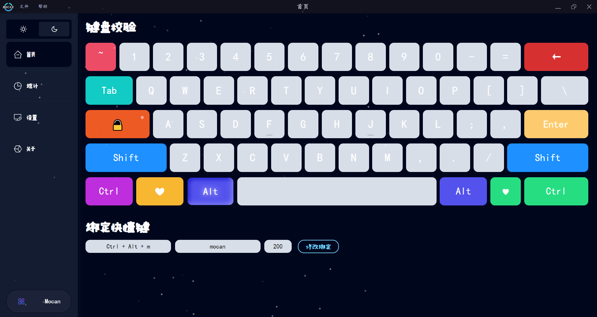
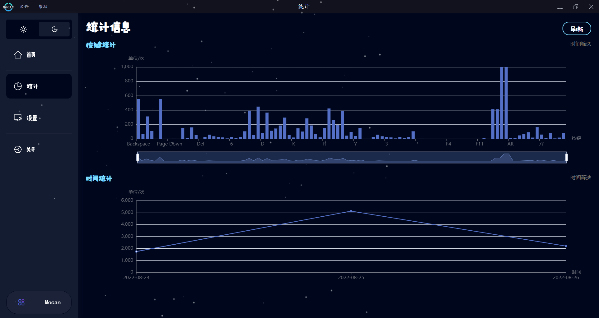
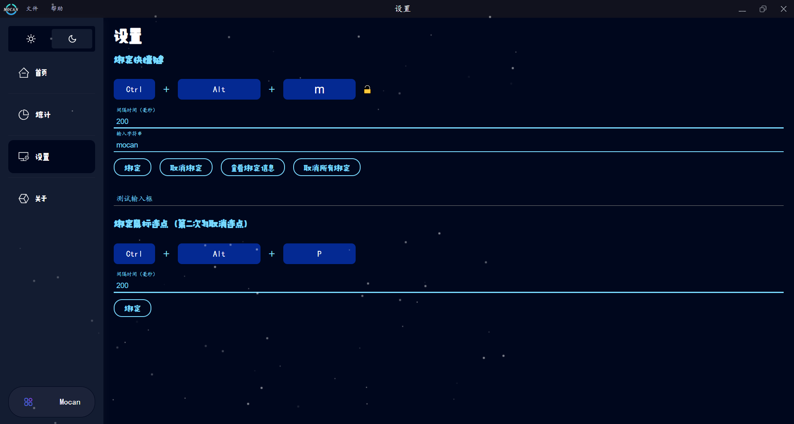
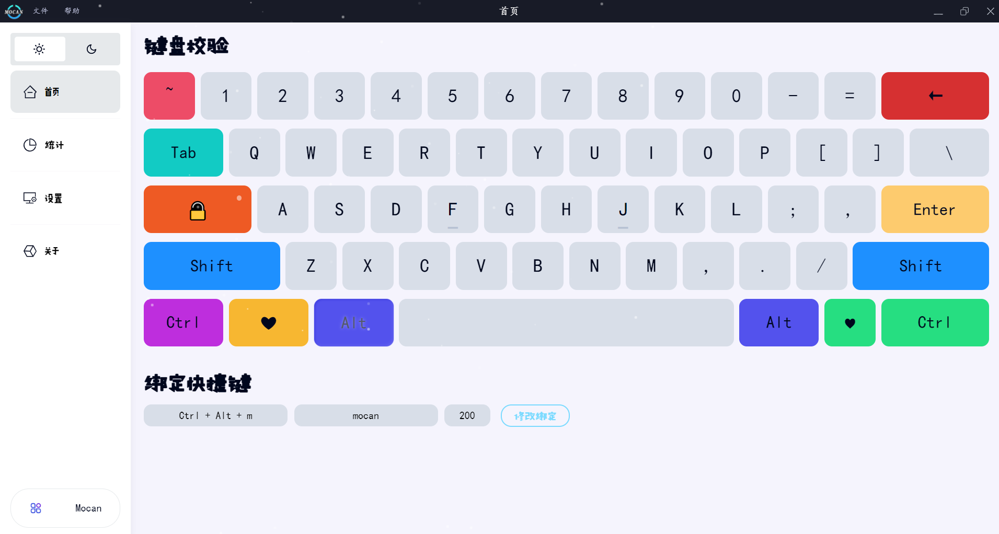

# Vue 3 + Vite + Electron

# 键盘监听+自动键盘输入+鼠标连点

# 运行截图

## 下载

[版本下载](https://github.com/Limbocan/cyan-keyboard/releases)

## 首页
- 键盘输入监听功能校验
- 展示已绑定快捷键

## 统计
- 按按键类别统计图
- 按日期统计图
- 按天筛选统计

## 设置
- 自定义自动输入绑定
- 鼠标连点绑定设置

## 主题
- 主题切换

